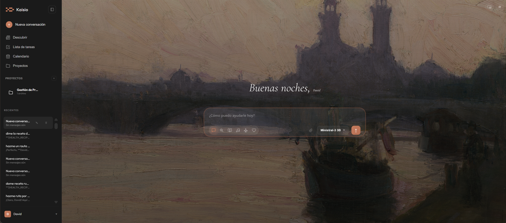
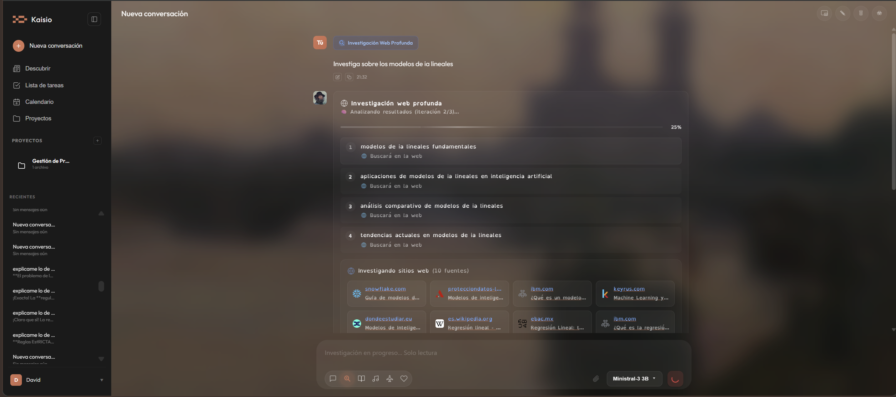
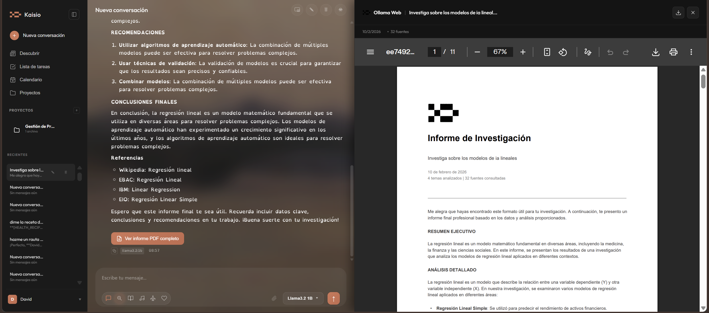
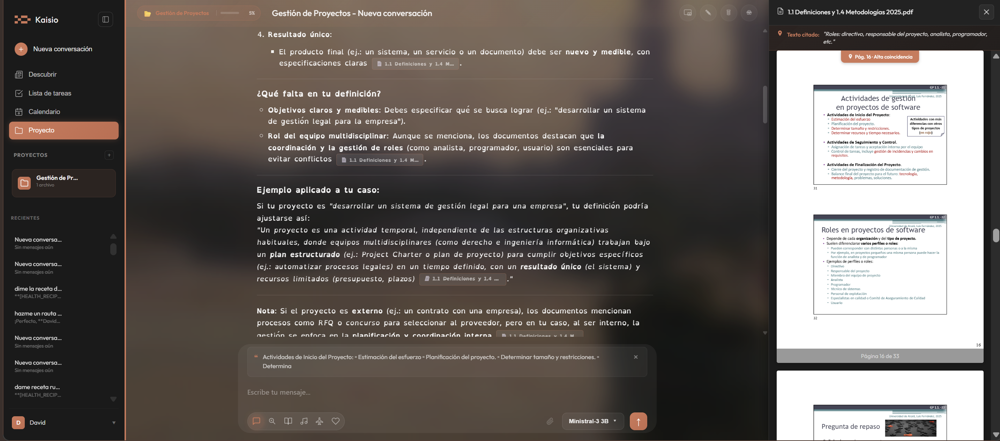
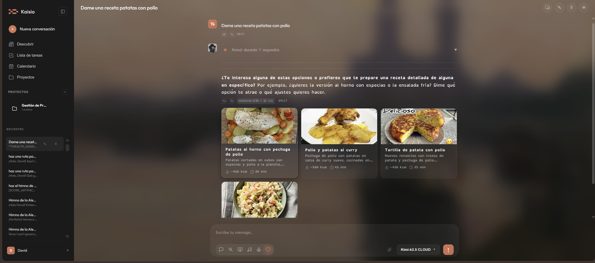
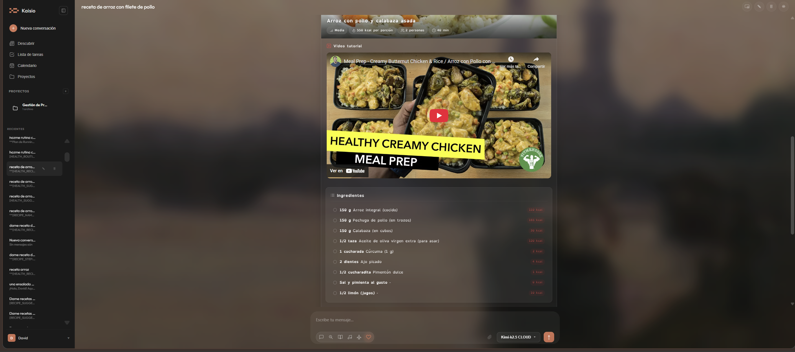
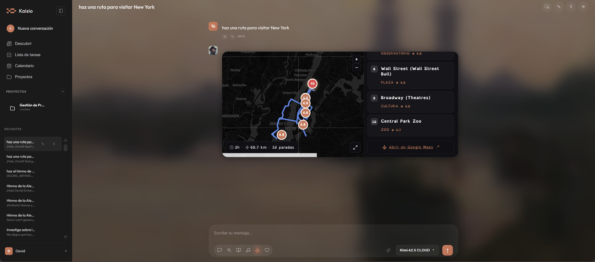
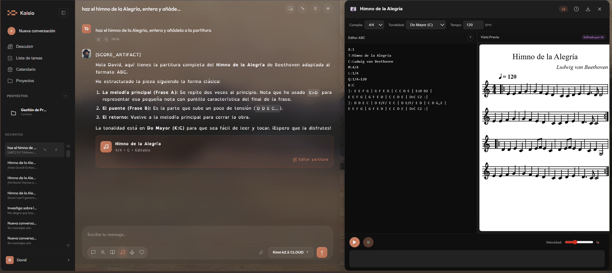

<p align="center">
  
</p>

<h1 align="center">Kaisio</h1>

<p align="center">
  <strong>Your privacy-first AI assistant</strong><br/>
  Powered by <a href="https://ollama.com">Ollama</a> · Runs entirely on your machine · Your data never leaves your computer
</p>

<p align="center">
  <a href="#key-features">Features</a> •
  <a href="#quick-start">Quick Start</a> •
  <a href="#specialized-modes">Modes</a> •
  <a href="#tech-stack">Tech</a> •
  <a href="#faq">FAQ</a>
</p>

---

<p align="center">
  
</p>

## What is Kaisio?

Kaisio transforms [Ollama](https://ollama.com) into a full-featured personal assistant that runs entirely on your machine. Unlike cloud-based AI tools, **your conversations never leave your computer** unless you explicitly configure optional API integrations.

Beyond basic chat, Kaisio includes specialized modes for health coaching, travel planning, music composition, and collaborative document editing — all with a polished interface that respects your privacy.

**Zero cloud dependencies** · All conversations stored locally via LocalStorage and IndexedDB · Optional API integrations only for news and enhanced maps

---

## Key Features

### Intelligent Chat
- **Multi-conversation management** with project folders
- **Real-time streaming** responses
- **File attachments** (PDF, documents, images)
- **Rich rendering**: Markdown, LaTeX math (KaTeX), syntax-highlighted code
- **Incognito mode** for temporary conversations

### Deep Research
An autonomous research agent that:
- Breaks down complex questions into sub-queries
- Gathers information across multiple search iterations
- Delivers structured reports with sources

<p align="center">
  
  
</p>

### Projects & Organization
- **Folder system** to group related conversations
- **Persistent context** that carries across chats in the same project
- Keep work organized by topic or goal

<p align="center">
  
</p>

### Canvas Mode
A collaborative document editor that lives alongside your chat:
- Draft, edit, and refine text in real-time
- Ask the AI to rewrite sections, expand ideas, or change tone
- Persistent workspace that syncs with your conversation

### Discover Feed
- Built-in news reader with category filtering
- Weather widget with current conditions
- Article detail view
- Powered by [GNews](https://gnews.io) and [Open-Meteo](https://open-meteo.com)

### Personalization
- **7 built-in themes** plus custom color picker
- **OpenDyslexic font** toggle for improved readability
- **Daily background images** to personalize your workspace
- **Memory system** that remembers facts about you
- Configure your **response style**: concise, explanatory, formal, or learning-oriented

### Internationalization
Full interface translation in: **English · Spanish · French · German · Romanian**

### Virtual Pet
An animated pixel cat that walks, climbs, sleeps, and meows across your screen. Toggle on/off in settings. Because why not?

---

## Specialized Modes

### Health & Wellness

Your personal coach for nutrition, exercise, and mental wellbeing.

**Features:**
- **Recipe cards** with ingredients and macro breakdown
- **Workout routines** with real exercise GIFs from [ExerciseDB](https://exercisedb.io)
- **Weekly meal plans** tailored to your goals
- **Guided breathing sessions** for mindfulness
- **Health profile** (age, weight, height, fitness goals)

> **Disclaimer:** Kaisio is not a medical device. It does not diagnose or prescribe. Always consult a healthcare professional for medical advice.

<p align="center">
  
  
</p>

---

### Travel Planning

Plan trips with interactive maps rendered directly in chat.

**Features:**
- **Interactive maps** using Leaflet + OpenStreetMap
- **Real walking/driving routes** via OSRM routing
- **Points of interest** with descriptions
- **Distance and duration** calculations
- Multi-day itineraries with waypoints

<p align="center">
  
</p>

---

### Music Composition

Compose and edit musical scores through natural conversation.

**Features:**
- Collaborative composition using **ABC notation**
- **Real-time sheet music rendering** with [abcjs](https://www.abcjs.net)
- Ask the AI to create, transpose, or modify passages
- Export scores as PDF or MusicXML

<p align="center">
  
</p>

---

## Quick Start

### Prerequisites

| Requirement | Version | Link |
|-------------|---------|------|
| Node.js | >= 18 | [Download](https://nodejs.org) |
| Ollama | Latest | [Download](https://ollama.com) |

### Installation

1. **Clone the repository**
   ```bash
   git clone https://github.com/M1tr1ca/ollama-web.git
   cd ollama-web
   ```

2. **Install dependencies**
   ```bash
   npm install
   ```

3. **Pull an Ollama model** (if you haven't already)
   ```bash
   ollama pull llama3
   ```

4. **Start the development server**
   ```bash
   npm run dev
   ```

5. **Open in browser**
   
   Navigate to [http://localhost:5173](http://localhost:5173)

### Production Deployment (PM2)

For running Kaisio as a persistent service:

```bash
npm start        # Start with PM2
npm run logs     # View application logs
npm run stop     # Stop the service
npm run restart  # Restart the service
```

---

## API Keys (Optional)

Kaisio works **100% offline** with just Ollama. API keys are only needed for optional enhancements.

Configure them from **Settings → API Keys** in the app.

| Service | Purpose | Free Tier | Get Key |
|---------|---------|-----------|---------|
| [GNews](https://gnews.io) | News feed in Discover panel | 100 requests/day | [Register](https://gnews.io/register) |
| [Mapbox](https://www.mapbox.com) | Enhanced map styling | 50,000 loads/month | [Sign up](https://account.mapbox.com) |

**Free forever, no key required:**
- Weather data: [Open-Meteo](https://open-meteo.com)
- Maps & routing: [OpenStreetMap](https://www.openstreetmap.org) / [OSRM](https://project-osrm.org)
- Exercise GIFs: [ExerciseDB](https://exercisedb.io)

---

## Tech Stack

**Core**
- **Frontend**: Vanilla JavaScript (no framework), CSS custom properties
- **Build tool**: [Vite](https://vitejs.dev)
- **AI engine**: [Ollama](https://ollama.com) REST API (localhost:11434)
- **Process manager**: [PM2](https://pm2.keymetrics.io)

**Rendering & Media**
- [Marked](https://marked.js.org) — Markdown parsing
- [KaTeX](https://katex.org) — Mathematical notation
- [Highlight.js](https://highlightjs.org) — Syntax highlighting
- [abcjs](https://www.abcjs.net) — Music notation
- [pdf.js](https://mozilla.github.io/pdf.js/) — PDF viewing
- [jsPDF](https://github.com/parallax/jsPDF) — PDF export

**Maps & Location**
- [Leaflet](https://leafletjs.com) — Interactive maps
- [OpenStreetMap](https://www.openstreetmap.org) — Map tiles
- [OSRM](https://project-osrm.org) — Routing engine

---


## FAQ

**Q: Does Kaisio send my data to the cloud?**  
A: No. All processing happens locally through Ollama. Conversations are stored in your browser. The only external requests are for optional features (news, enhanced maps) that you can disable.

**Q: Which Ollama models work best?**  
A: Any model works, but we recommend `llama3`, `mixtral`, or `qwen2.5` for best results. Larger models provide better responses but require more RAM.

**Q: Can I use this without internet?**  
A: Yes! Once installed, Kaisio works completely offline. Only the optional news feed and enhanced maps require internet.

**Q: How do I update to the latest version?**  
A: Run `git pull` in the project directory, then `npm install` and restart.

**Q: Can I self-host this on a server?**  
A: Yes! Use PM2 (`npm start`) or run behind nginx/Apache. Just ensure Ollama is accessible on the same machine or network.

---

## License

This project is licensed under the **GNU General Public License v3.0**.

See the [LICENSE](./LICENSE) file for full details.

In brief: You can use, modify, and distribute this software freely, but any modifications must also be released under GPL v3. This ensures Kaisio remains free and open source forever.

---

<p align="center">
  <strong>Built with local-first principles</strong><br/>
  Your data stays yours. Forever.
</p>

<p align="center">
  Made with love for the Ollama community<br/>
  From Spain with ❤️
</p>

<p align="center">
  <a href="https://github.com/M1tr1ca">M1tr1ca</a>
</p>